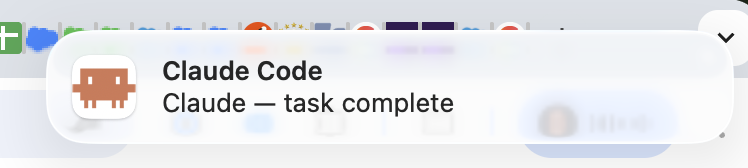

# Claude Code macOS Notifications

Get native macOS Notification Centre banners when Claude Code finishes a task or needs your input.



## What you get

| Event | Banner message | Sound |
|-------|---------------|-------|
| Task complete | "Task complete" | Glass |
| Needs your input | "Pending question" | Purr |

## Requirements

- macOS
- [Homebrew](https://brew.sh)
- [Claude Code CLI](https://docs.anthropic.com/en/docs/claude-code)

## Setup (3 minutes)

### 1. Download the setup script

Save [`setup-notifications.sh`](../scripts/setup-notifications.sh) somewhere on your Mac.

### 2. Run the script

```bash
chmod +x setup-notifications.sh
./setup-notifications.sh
```

The script will:

1. Install `terminal-notifier` via Homebrew
2. Copy the bundled Claude Code icon to `~/.claude/claude-icon.png` (if you don't already have one)
3. Convert your icon and apply it to the app bundle
4. Add notification hooks to `~/.claude/settings.json`
5. Send a test notification

You'll be prompted for your password once (to clear the macOS icon cache).

> **Important:** When the test notification fires, a notification permission alert will appear in the **top-right corner** of your screen. You **must click it and select "Allow"** to enable notifications. If you dismiss or deny it, notifications won't work — you can re-enable them later in **System Settings > Notifications > terminal-notifier**.

### 3. Clear the macOS icon cache

macOS aggressively caches app icons, so the custom icon **won't appear until you clear the cache**. Run these commands in order:

```bash
sudo rm -rf /Library/Caches/com.apple.iconservices.store
sudo find /private/var/folders/ -name com.apple.iconservices -exec rm -rf {} \; 2>/dev/null
sudo killall Dock
killall Finder
```

> The setup script attempts this automatically, but it doesn't always take effect until you complete step 4.

### 4. Log out and back in

**Apple menu > Log Out**, then log back in. This is required for macOS to pick up the new icon. You only have to do this once.

### 5. Verify the icon

```bash
terminal-notifier -title "Claude Code" -message "Icon test" -appIcon ~/.claude/claude-icon.png -sound Glass
```

You should see a notification banner with the Claude Code icon. If it still shows the default terminal icon, **restart your Mac** and test again.

## Customisation

### Change notification sounds

Edit `~/.claude/settings.json` and change the `-sound` value in each hook. macOS built-in sounds include:

`Basso`, `Blow`, `Bottle`, `Frog`, `Funk`, `Glass`, `Hero`, `Morse`, `Ping`, `Pop`, `Purr`, `Sosumi`, `Submarine`, `Tink`

### Disable sounds entirely

**System Settings > Notifications > terminal-notifier** — toggle off "Play sound for notifications".

### Use a different icon

Replace `~/.claude/claude-icon.png` with any 512x512+ PNG, then re-run the setup script.

## After Homebrew upgrades

If you run `brew upgrade terminal-notifier`, the icon resets to the default. Just re-run the setup script:

```bash
./setup-notifications.sh
```

## Manual setup (if you prefer)

If you'd rather not run the script, here's what it does:

**Install terminal-notifier:**

```bash
brew install terminal-notifier
```

**Add hooks to `~/.claude/settings.json`:**

Add the following inside your existing settings (merge with any existing keys):

```json
{
  "hooks": {
    "Stop": [
      {
        "hooks": [
          {
            "type": "command",
            "command": "terminal-notifier -title \"Claude Code\" -message \"Task complete\" -appIcon ~/.claude/claude-icon.png -sound Glass",
            "timeout": 10
          }
        ]
      }
    ],
    "Notification": [
      {
        "hooks": [
          {
            "type": "command",
            "command": "terminal-notifier -title \"Claude Code\" -message \"Pending question\" -appIcon ~/.claude/claude-icon.png -sound Purr",
            "timeout": 10
          }
        ]
      }
    ]
  }
}
```

**Replace the app icon (optional):**

```bash
# Create icon sizes
mkdir -p /tmp/claude-icon.iconset
for size in 16 32 64 128 256 512; do
  sips -z $size $size ~/.claude/claude-icon.png --out /tmp/claude-icon.iconset/icon_${size}x${size}.png
done
for size in 16 32 64 128 256; do
  double=$((size * 2))
  sips -z $double $double ~/.claude/claude-icon.png --out /tmp/claude-icon.iconset/icon_${size}x${size}@2x.png
done

# Convert to ICNS
iconutil -c icns /tmp/claude-icon.iconset -o /tmp/claude-icon.icns

# Replace in app bundle
cp /tmp/claude-icon.icns "$(brew --prefix terminal-notifier)/terminal-notifier.app/Contents/Resources/Terminal.icns"

# Clear icon cache
sudo rm -rf /Library/Caches/com.apple.iconservices.store
sudo find /private/var/folders/ -name com.apple.iconservices -exec rm -rf {} \; 2>/dev/null
sudo killall Dock
killall Finder
```

Then log out and back in.

## Troubleshooting

### Custom icon not showing

macOS aggressively caches app icons. If the notification still shows the default icon after running the setup script:

1. **Clear the icon cache manually:**

   ```bash
   sudo rm -rf /Library/Caches/com.apple.iconservices.store
   sudo find /private/var/folders/ -name com.apple.iconservices -exec rm -rf {} \; 2>/dev/null
   sudo killall Dock
   killall Finder
   ```

2. **Log out and back in** (or restart your Mac).

3. **Send a test notification** to confirm:

   ```bash
   terminal-notifier -title "Claude Code" -message "Icon test" -appIcon ~/.claude/claude-icon.png -sound Glass
   ```

If the icon still doesn't appear after a restart, re-run the full setup script — this re-applies the icon to the app bundle and clears the cache again.

### Other issues

| Problem | Solution |
|---------|----------|
| No notifications appear | Check **System Settings > Notifications > terminal-notifier** is enabled |
| Icon reset after upgrade | Re-run `./setup-notifications.sh` |
| Notifications too noisy | Disable sounds in System Settings (see above) |
